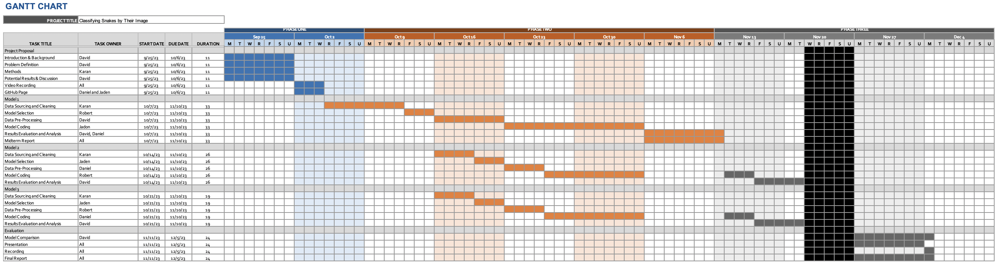

<h1><ins>Introduction</ins></h1>

Snakes: [Dataset](https://www.kaggle.com/datasets/goelyash/165-different-snakes-species/data)

Snakes are among the top three most dangerous creatures, and identification is very
difficult, often relying on strong herpetological skills that require identification by characteristics
such as head shape and body colour [3] . This approach has limitations, and by
automating the identification process, it will be easier for people to avoid venomous snakes
while also helping healthcare providers provide better treatment.

The use of ML algorithms can greatly increase the accuracy of snake identification, and these 
algorithms have the potential to mitigate the negative impacts of mistreatment of snake bites. 
It is very important to understand whether a given snake is venomous or not since diagnosis and 
treatment differ greatly between the two [1] . Studies have found that 12% of nonvenomous 
snakebites were treated as if there were necrosis [2] , and this number can be greatly 
decreased by these algorithms.

There are other benefits in the healthcare industry as well. These algorithms can be a 
low-cost alternative to having skilled individuals classify snakes, helping to
provide aid to healthcare providers in low-resource settings. Snake venom is also a sought-after
drug, and classifying a snake could help scientists quickly find which snakes are useful for
harvesting venom [2] . Furthermore, efficient classification could also help zoologists and
conservationists alike better understand snake populations around the globe.

<h1><ins>Problem Definition</ins></h1>

Accurate classification of snakes is important for identifying how venomous or
nonvenomous the creature is to humans. The goal of this project is to identify snake species
quickly and accurately, minimising false negatives and false positives to ensure accurate
identification.

Our dataset has 135 different species of snakes using 24,000 images from a Kaggle dataset. Each
image is labelled by the binomial name for the snake, the country where it is found, the
continent, genus, family, and sub-family.

<h1><ins>Data Collection and Pre-Processing</ins></h1>

The data was collected from the Kaggle dataset, and to minimise the amount of time and computing power needed train the model, we used 10 classes out of the total 135 classes. Before working with our models, it was crucial that we cleaned and pre-processed the data for enhanced accuracy in the results. As part of the pre-processing steps, the following tasks were performed on the dataset:

  
  1. 
<ins>Labelling the Images</ins>

      
To start, the data was simply located in folders that were not labelled in any sort of fashion. To facilitate supervised learning, each image was labelled according to its scientific name, country of origin, continent, genus, family, and sub-family. All images were labelled according to the information present in the CSV file describing each snake and its origins.

  
  2. 
<ins>Resizing the Images</ins>

     
All the images in the original dataset were of various shapes and sizes. To make the data usable for training on our model, we had to resize each individual image to a uniform size of (256, 256, 3). The result of resizing the images is illustrated below:

     
     
  3. 
<ins>Normalising Pixel Values</ins>

    
     
After resizing each individual image, the next step was to normalise the pixel values by ensuring that all the RGB values of each pixel would be in the range of [0,1]. This would help to make the data easier for the model to train on.

  4. 
<ins>Dimensionality Reduction Using PCA</ins>

     
Lastly, as part of the unsupervised learning methods and data pre-processing, we utilised PCA to reduce the dimensions of the data in hopes of making the model more efficient and less computationally-expensive. Before applying PCA, we had to check how many features could be retained so that the explained variance would still be 95%. To do this, we first split each image into 3 channels: Red, Green, Blue. The image of the data split into its 3 respective channels is below:

     

     
We then transformed the data into fewer and fewer components, and along the way, we checked the sum of the explained variance ratios of the PCA components. In the end, we kept 30 principal components to ensure 95% retained variance.  The bar charts visualising the explained variance ratio by each eigenvalue for each of the 3 channels is below:

     

The result of the data pre-processing can be found below:

Once the data was cleaned and structured, we were ready to begin using it to train our models. To facilitate better visualisations, in place of the snake name, labels were used. The mapping is given below:

| Species Scientific Name | Label |
| --- | --- |
| Aspidites melanocephalus | 41 |
| Bothriechis schlegelii | 83 |
| Carphophis vermis | 111 |
| Leptodeira annulata | 373 |
| Leptophis mexicanus | 384 |
| Ophiophagus hannah | 497 |
| Pseudonaja textilis | 590 |
| Rhabdophis subminiatus | 616 |
| Thamnophis ordinoides | 698 |
| Vipera seoanei | 751 |

<h1><ins>Methods</ins></h1>
<h2><i>Supervised Learning</i></h2>

For the midterm report, we have used convolutional neural networks as our supervised learning method. CNN is a popular method used for image classification in the computer vision space, and they have been used for tasks such as classifying flower types and analysing documents

<h3>CNN</h3>

To implement this method, we used the keras package to create the neural network. To cut down on computation time, we used 10 classes to test and train the model, and through our testing, we found that accuracy remained around 98 percent for test data and 88 percent for train data. Here is the structure we used for the model:

The network we used has sequential layers, meaning that the output from the previous layer is used as the input for the next layer of the model. For the hidden layers in our model, we alternated between convolutional and max pooling layers. To start, we used 32 filters to capture the details within the image since many of our images had snakes that were hard to see or slightly concealed by the image background. Later on, we would decrease this to 16 to capture the general essence of the image. For this model, max pooling was utilised since it captures the most essential pieces of the image. The data was also flattened in our model. After this, we utilised dense layers: these were used to distinguish the images more clearly. The final dense layer has 10 nodes, matching the number of classes of snakes, and we utilised an activation layer with softmax activation function to help classify the images. With this model, we were able to attain 98% accuracy in the training data and 88% accuracy in the testing data. In total, we used 12 Epochs, as it seemed appropriate given the size of the data as to prevent overfitting. As expected, the training data accuracy is slightly higher than the testing data accuracy, but they are close enough, so there is a minimal amount of overfitting in our model. The accuracy and loss functions are plotted below:

Looking at our confusion matrix below, it seems that for most species in our training dataset, our model was consistent in labelling what they were. The model seemed to struggle with accurately differentiating between Carphophis vermis and Ophiophagus hannah, as illustrated in the confusion matrix. This does make sense, as looking at the images in the dataset, there are definitely similarities between the two species in terms of their images, as well as in terms of their characteristics, such as body colour. If more species are added in future iterations of this project, it will likely be less of an issue. Given the visual similarities of all the snakes in the images as well as the similarities within the various backgrounds of the images in our dataset, it is surprising that there is very little error present in our results at this time.

<h4><ins>Results and Discussion</ins></h4>

The model achieved an astounding accuracy level of 88.13%, and the precision, recall, and f1 score were 99.89%, 92.87%, and 96.30% respectively. These results indicate that the CNN model does extremely well in the task of classifying snakes based on image data, and the model’s ability to learn hierarchical features from images along with the utilisation of convolutional and pooling layers, regularisation, and activation functions seemed to contribute to its strong ability to accurately identify snakes based on their image data. If this model were to be refined even further, it is likely that there would be an even higher accuracy score and even better identification outcomes.
 

<h2><i>Supervised Learning</i></h2>

When first downloading our dataset, all of the snake species images were already separated out into their respective folders based on the label for the given snake species. Because of this, it is much easier to levrage unsupervised learning methods for the problem introduced in the problem statement above, as the number of clusters can be deterministically set for methods such as K-Means.

<h3>PCA</h3>

For data-preprocessing, we leveraged PCA, or Principal Component Analysis, to reduce the number of dimensions in the image data. PCA is a technique traditionally used in machine learning for dimensionality reduction, and we utilised it to decrease the number of components in our original images. To accomplish this, we first determined the number of principal components that we needed to keep in order to retain 95% of the original variance in the data. To do this, we realised that we needed to keep 30 principal components to retain 95% of the original variance. Thus, we used the PCA implementation from Scikit-Learn with 30 components.

After performing PCA and printing out the original image and resulting image side-by-side, it was amazing how much of the original detail from the original image was preserved in the transformed image. Furthermore, by performing PCA, we had reduced the size of the data down from 3GB to only a few hundred MB. This reduction in dimensionality from PCA will help to improve the efficiency of the model as well as reduce the computational overhead needed to train and run these models.

<h4><ins>Contribution Table</ins></h4>

| Name | Contribution |
| --- | --- |
| Jadon Co | •	Building and training CNN model   •	Applying PCA to dataset |
| Robert Jeon | •	Managing GitHub page   •	Helping to build CNN model  |
| Karan Patel | •	Data sourcing and cleaning   •	Applying PCA to dataset  |
| David Qu |•	Data resizing and normalisation   •	Results and Discussion   •	Writing up midterm report  |
| Jehyeok Woo | •	Evaluation metrics for CNN method (Confusion Matrix, F1 Score, Precision-Recall Curve)   •	Data visualisation for midterm report |

<h4><ins>Updated Gantt Chart</ins></h4>

<h4><ins>References</ins></h4>

[1] Niteesh., I., Venkat.A, M. S., Vahed., S., Dattu.P, N., &amp; Srilatha., M. (2021). Classification
and prediction of snake species based on snakes’ visual features using machine learning. 2021
2nd Global Conference for Advancement in Technology (GCAT).
https://doi.org/10.1109/gcat52182.2021.9587711

[2] Progga, N. I., Rezoana, N., Hossain, M. S., Islam, R. U., &amp; Andersson, K. (2021). A CNN
based model for venomous and non-venomous snake classification. Applied Intelligence and
Informatics, 216–231. https://doi.org/10.1007/978-3-030-82269-9_17

[3] Rajabizadeh, M., &amp; Rezghi, M. (2021). A comparative study on image-based snake
identification using machine learning. Scientific Reports, 11(1). https://doi.org/10.1038/s41598-
021-96031-1

