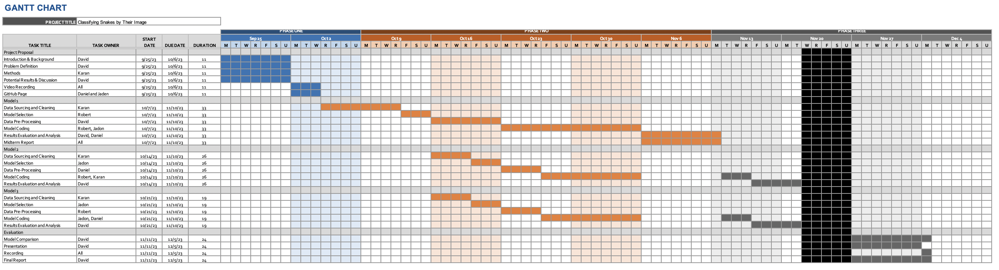

<h1><ins>Identifying Snakes by their Species Images</ins></h1>
<h1><ins>Introduction</ins></h1>

Snakes: [Dataset](https://www.kaggle.com/datasets/goelyash/165-different-snakes-species/data)

Snakes are among the top three most dangerous creatures, and identification is very
difficult, often relying on strong herpetological skills that require identification by characteristics
such as head shape and body colour [3] . This approach has limitations, and by
automating the identification process, it will be easier for people to avoid venomous snakes
while also helping healthcare providers provide better treatment.

The use of ML algorithms can greatly increase the accuracy of snake identification, and these 
algorithms have the potential to mitigate the negative impacts of mistreatment of snake bites. 
It is very important to understand whether a given snake is venomous or not since diagnosis and 
treatment differ greatly between the two [1] . Studies have found that 12% of nonvenomous 
snakebites were treated as if there were necrosis [2] , and this number can be greatly 
decreased by these algorithms.

There are other benefits in the healthcare industry as well. These algorithms can be a 
low-cost alternative to having skilled individuals classify snakes, helping to
provide aid to healthcare providers in low-resource settings. Snake venom is also a sought-after
drug, and classifying a snake could help scientists quickly find which snakes are useful for
harvesting venom [2] . Furthermore, efficient classification could also help zoologists and
conservationists alike better understand snake populations around the globe.

<h1><ins>Problem Definition</ins></h1>

Accurate classification of snakes is important for identifying how venomous or
nonvenomous the creature is to humans. The goal of this project is to identify snake species
quickly and accurately, minimising false negatives and false positives to ensure accurate
identification.

Our dataset has 135 different species of snakes using 24,000 images from a Kaggle dataset. Each
image is labelled by the binomial name for the snake, the country where it is found, the
continent, genus, family, and sub-family.

<h1><ins>Data Collection and Pre-Processing</ins></h1>

The data was collected from the Kaggle dataset, and to minimise the amount of time and computing power needed train the model, we used 10 classes out of the total 135 classes. Before working with our models, it was crucial that we cleaned and pre-processed the data for enhanced accuracy in the results. As part of the pre-processing steps, the following tasks were performed on the dataset:

  
  1. 
<ins>Labelling the Images</ins>

      
To start, the data was simply located in folders that were not labelled in any sort of fashion. To facilitate supervised learning, each image was labelled according to its scientific name, country of origin, continent, genus, family, and sub-family. All images were labelled according to the information present in the CSV file describing each snake and its origins.

  
  2. 
<ins>Resizing the Images</ins>

     
All the images in the original dataset were of various shapes and sizes. To make the data usable for training on our model, we had to resize each individual image to a uniform size of (256, 256, 3). The result of resizing the images is illustrated below:

     
     
  3. 
<ins>Normalising Pixel Values</ins>

    
     
After resizing each individual image, the next step was to normalise the pixel values by ensuring that all the RGB values of each pixel would be in the range of [0,1]. This would help to make the data easier for the model to train on.

  4. 
<ins>Dimensionality Reduction Using PCA</ins>

     
Lastly, as part of the unsupervised learning methods and data pre-processing, we utilised PCA to reduce the dimensions of the data in hopes of making the model more efficient and less computationally-expensive. Before applying PCA, we had to check how many features could be retained so that the explained variance would still be 95%. To do this, we first split each image into 3 channels: Red, Green, Blue. The image of the data split into its 3 respective channels is below:

     

     
We then transformed the data into fewer and fewer components, and along the way, we checked the sum of the explained variance ratios of the PCA components. In the end, we kept 30 principal components to ensure 95% retained variance.  The bar charts visualising the explained variance ratio by each eigenvalue for each of the 3 channels is below:

     

The result of the data pre-processing can be found below:

Once the data was cleaned and structured, we were ready to begin using it to train our models. To facilitate better visualisations, in place of the snake name, labels were used. The mapping is given below:

| Species Scientific Name | Label |
| --- | --- |
| Aspidites melanocephalus | 41 |
| Bothriechis schlegelii | 83 |
| Carphophis vermis | 111 |
| Leptodeira annulata | 373 |
| Leptophis mexicanus | 384 |
| Ophiophagus hannah | 497 |
| Pseudonaja textilis | 590 |
| Rhabdophis subminiatus | 616 |
| Thamnophis ordinoides | 698 |
| Vipera seoanei | 751 |

<h1><ins>Methods</ins></h1>
<h2><i>Supervised Learning</i></h2>

For this project, we chose to use two differing supervised learning methods: Convolutional Neural Networks (CNNs) and Decision Tree. CNNs are commonly used for image classification in the realm of computer vision, and they have been used for various tasks such as classifying flower types and disease detection in the medical field or analysing documents. Aside from the CNN algorithm, we also decided to explore the usage of decision trees for image classification to see how it compares to CNN in terms of classifying snakes by their images.

<h3>CNN</h3>

To implement this method, we used the keras package to create the neural network. To cut down on computation time, we used 10 classes to test and train the model, and through our testing, we found that accuracy remained around 98 percent for test data and 88 percent for train data. Here is the structure we used for the model:

The network we used has sequential layers, meaning that the output from the previous layer is used as the input for the next layer of the model. For the hidden layers in our model, we alternated between convolutional and max pooling layers. To start, we used 32 filters to capture the details within the image since many of our images had snakes that were hard to see or slightly concealed by the image background. Later on, we would decrease this to 16 to capture the general essence of the image. For this model, max pooling was utilised since it captures the most essential pieces of the image. The data was also flattened in our model. After this, we utilised dense layers: these were used to distinguish the images more clearly. The final dense layer has 10 nodes, matching the number of classes of snakes, and we utilised an activation layer with softmax activation function to help classify the images. With this model, we were able to attain 98% accuracy in the training data and 88% accuracy in the testing data. In total, we used 12 Epochs, as it seemed appropriate given the size of the data as to prevent overfitting. As expected, the training data accuracy is slightly higher than the testing data accuracy, but they are close enough, so there is a minimal amount of overfitting in our model. The accuracy and loss functions are plotted below:

Looking at our confusion matrix below, it seems that for most species in our training dataset, our model was consistent in labelling what they were. The model seemed to struggle with accurately differentiating between Carphophis vermis and Ophiophagus hannah, as illustrated in the confusion matrix. This does make sense, as looking at the images in the dataset, there are definitely similarities between the two species in terms of their images, as well as in terms of their characteristics, such as body colour. If more species are added in future iterations of this project, it will likely be less of an issue. Given the visual similarities of all the snakes in the images as well as the similarities within the various backgrounds of the images in our dataset, it is surprising that there is very little error present in our results at this time.

<h4><ins>Results and Discussion</ins></h4>

The model achieved an astounding accuracy level of 88.13%, and the precision, recall, and f1 score were 99.89%, 92.87%, and 96.30% respectively. These results indicate that the CNN model does extremely well in the task of classifying snakes based on image data, and the model’s ability to learn hierarchical features from images along with the utilisation of convolutional and pooling layers, regularisation, and activation functions seemed to contribute to its strong ability to accurately identify snakes based on their image data. If this model were to be refined even further, it is likely that there would be an even higher accuracy score and even better identification outcomes.
 

<h3>Decision Tree</h3>

As our second supervised learning model, we decided to use the Decision Tree algorithm since it is also traditionally used in the realm of image classification. For this implementation, we utilised the functions provided by the scikit-learn (sklearn) library, as this library is popular in the machine learning space. 

For this implementation, one of the major challenges that we faced was hyperparameter optimisation. The model ran extremely slowly, and it was difficult to select values for hyperparameters that would return satisfactory accuracy results. Despite our best efforts to optimise the hyperparameters, the test accuracy of our decision tree model remained around 29%. For our model, we had a maximum depth of XXX, and this value was determined through various experimentations and tuning. As seen in our confusion matrix and precision-recall curve below, the decision tree model struggled to accurately identify snakes by their species given their image.

To potentially enhance the performance of our implementation of the decision tree algorithm, we explored data processing techniques such as compression and normalisation. However, these methods of processing the data did very little to impact the performance of our model, and they did not greatly improve the accuracy of our implementation. Even though decision trees are known for their simplicity and relative ease of implementation, our findings illustrate that the data used in this case is not particularly suited for the decision tree model, as evident from the test accuracy that our model achieved. 

When comparing the results from our decision tree model with our CNN model, it is obvious that the CNN model extremely outperformed the decision tree model in terms of accuracy. This is expected, as the CNN model is known for being able to capture complex patterns in data with high accuracy. Because of this, it follows that when there are scenarios where fine-tuned modelling is required and where computational resources are available, the CNN model is much more suitable for achieving superior accuracy results when compared to the decision tree model.

<h4><ins>Results and Discussion</ins></h4>

Overall, even though decision trees are often favoured for their simplicity in implementation and relatively low need for computational resources, our findings, in this case, illustrate that the performance of the decision tree algorithm heavily depends on the nature and complexity of the data fed into the model. In our case, because the data required much more fine-grained predictions to be correctly classified, a CNN model offered superior results in comparison to the decision tree model. This concept can also be applied to other projects: When more specific predictions are required and when computation resources are not necessarily limited, the CNN model likely will provide more accurate results when compared to the decision tree model.

<h2><i>Supervised Learning</i></h2>

When first downloading our dataset, all of the snake species images were already separated out into their respective folders based on the label for the given snake species. Because of this, it is much easier to levrage unsupervised learning methods for the problem introduced in the problem statement above, as the number of clusters can be deterministically set for methods such as K-Means.

<h3>PCA</h3>

For data-preprocessing, we leveraged PCA, or Principal Component Analysis, to reduce the number of dimensions in the image data. PCA is a technique traditionally used in machine learning for dimensionality reduction, and we utilised it to decrease the number of components in our original images. To accomplish this, we first determined the number of principal components that we needed to keep in order to retain 95% of the original variance in the data. To do this, we realised that we needed to keep 30 principal components to retain 95% of the original variance. Thus, we used the PCA implementation from Scikit-Learn with 30 components.

After performing PCA and printing out the original image and resulting image side-by-side, it was amazing how much of the detail from the original image was preserved in the transformed image. Furthermore, by performing PCA, we had reduced the size of the data down from 3GB to only a few hundred MB. This reduction in dimensionality from PCA will help to improve the efficiency of the model as well as reduce the computational overhead needed to train and run these models.

<h3>K-Means</h3>

As another one of our unsupervised approaches to the problems, we decided to use the K-Means algorithm to classify our images. This was a very interesting approach, as compared to the other methods used, K-Means is a relatively simple clustering algorithm. In the realm of unsupervised learning methods, K-Means is a popular clustering algorithm that can be used for clustering, and we used it to see how its performance compared to its supervised learning counterparts. In our use of K-Means, we applied the K-Means algorithm to our snake species dataset which was already divided into 10 distinct folders based on our species labels. We set the number of clusters to 10, as there were 10 different species that we were dealing with. 

When using K-Means, one of the main difficulties that we faced was that many of the images were very similar to one another in terms of both colour and background. Because of this, it was relatively difficult to tune the parameters of the algorithm to produce a high level of accuracy. As seen in the graph below, most of the clusters were relatively distinct, and the amount of overlap between clusters was minimal.

In our clustering algorithm, we achieved a silhouette score of 0.4 when using 10 clusters, and the silhouette scores for different values of K can be seen in the graph below. 

Our K-Means model produced an accuracy of around 94.72%, which was determined by evaluating the model’s performance by using a precision-recall curve. As seen below, this curve provides insights into the trade-off between precision and recall for different classification thresholds, and it can be used to help select an appropriate threshold for classification based on the desired precision and recall levels. 

<h4><ins>Results and Discussion</ins></h4>

Overall, this model achieved a precision, recall, and f1 score of 61.46%, 67.09%, and 61.14% respectively. These results indicate that the K-Means model does relatively well at the task of classifying snakes based on image data, but it tended to struggle when the features such as background colour and texture were similar between varying species of snake. To some degree, there was a bit of overfitting in our model, as there was a relatively large gap between the accuracy of the training and testing datasets. If there were time to refine this model further, there would likely be an even higher accuracy score and clearer identification outcomes. 

<h1><ins>Results and Discussion</ins></h1>

The performance of the CNN model, Decision Tree model, and K-Means model on classifying snakes based on their species image were evaluated and the results are summarised in the table below:

| Model | Accuracy | Precision | Recall | F1 Score |
| --- | --- | --- | --- | --- |
| CNN | 88.13% | 99.89% | 92.87% | 96.30% |
| Decision Tree | 28.89% | 24.74% | 20.83% | 22.62% |
| K-Means | 94.72% | 61.46% | 67.09% | 64.14% |

Although the K-Means algorithm attained the highest accuracy score of 94.72%, there was some overfitting in the model, and the model had lower precision, recall, and f1 scores of 61.46%, 67.09%, and 64.14% respectively. In contrast, the CNN model had the best precision, recall, and f1 values at 99.89%, 92.87%, and 96.30% respectively, and it had an accuracy of 88.13%. The decision tree algorithm performed the worst with an accuracy of 28.89%.

These results indicate that despite having the highest accuracy value using the K-Means algorithm, it seems that the CNN model performed better than the other two models in terms of overall performance for snake species classification based on image data. The CNN model can learn hierarchical features from images, and its inclusion of features such as convolutional and pooling layers contributed to its superior performance, which is reflected in its precision and recall values. Further optimisation and refinement of this model could potentially lead to even higher accuracy and better classification outcomes, but this could also be said of the other models. 

<h1><ins>Conclusion</ins></h1>

The project of classifying snake species using machine learning techniques has not only taught us the value of various machine learning techniques and methods, but it also was extremely interesting and has the potential for significant real-world applications. The scope of this project could be expanded to incorporate snake species classification into the daily lives of many individuals, and it could also be used in various fields such as pest management and healthcare or conservation efforts. Throughout this project, various supervised and unsupervised learning methods were utilised, and methods for pre-processing the data were also explored to determine which ones gave the best results. 

One of the most notable findings was that the Convolutional Neural Network (CNN) model outperformed all other methods of classification, achieving a very high accuracy of 88.13% and an F1 score of 96.30%. This is likely due to the CNN algorithm’s ability to capture complex patterns in image data through the usage of convolutional and pooling layers, and this fact was extremely useful in accurately classifying snake species based on their visual features. 

One of the main challenges that we faced was optimising hyperparameters for the Decision Tree algorithm. Tuning hyperparameters to find optimal values and ensure maximising model performance was extremely difficult and time-consuming, and it required lots of trial and error and fine-tuning. Thus, this led to a much lower accuracy score for the Decision Tree algorithm. Through this project, it is clear that hyperparameter optimisation is an important area for further research that has the potential to drastically improve the performance of the Decision Tree model.

One significant finding through this project was the impact of data pre-processing and cleaning. Pre-processing and data cleaning techniques had a non-trivial effect on model performance, and techniques such as normalisation, feature extraction, and data augmentation greatly helped to improve not only the accuracy but also the efficiency of the models utilised. Using proper pre-processing techniques such as normalising pixel values and PCA helped to standardise data across various features, reduce noise, and enhance the ability of models to find and extract the meaningful patterns held within the data. 

Overall, the effects of data pre-processing were not only significant but it is also clear that they have practical applications in real-world examples. For example, accurate and efficient classification of snakes can help pest control to better understand which snakes are native and which ones are invasive, and classification in the medical field can help professionals determine which species have venom that can be utilised to create life-saving antivenom for individuals who are bitten. Additionally, in conservation efforts, accurate snake species classification can aid in monitoring and protecting both endangered and threatened snake species. 

In general, this project on classifying snake species using machine learning techniques was extremely interesting and practical for real-life applications. Our findings illustrate the strong performance of the CNN model, the challenges faced in hyperparameter tuning, and the significant value of data pre-processing and feature extraction in helping to improve model performance. The potential that research in the area of snake classification has many real-life applications in fields such as conservation, medicine, and pest control, and further research in this area has the potential to greatly benefit both the environment and individuals alike.

<h4><ins>Contribution Table</ins></h4>

| Name | Contribution |
| --- | --- |
| Jadon Co | •	Building and training CNN model   •	Applying PCA to dataset   •	Building and training Decision Tree model   •	Evaluation metrics for Decision Tree model |
| Robert Jeon | •	Managing GitHub page   •	Helping to build CNN model   •	Building and training K-Means model   •	Evaluation metrics for K-Means model|
| Karan Patel | •	Data sourcing and cleaning   •	Applying PCA to dataset   •	Analyzing K-Means Model   •	Editing data preprocessing section|
| David Qu |•	Data resizing and normalisation   •	Results and Discussion   •	Writing up midterm report   •	Writing up final report   •	Conclusion    •	Putting together slide deck and video presentation|
| Jehyeok Woo | •	Evaluation metrics for CNN method (Confusion Matrix, F1 Score, Precision and Recall)   •	Data visualisation for midterm and final reports   •	Optimising hyperparameters for Decision Tree model   •	Reviewing all requirements are met |

<h4><ins>Updated Gantt Chart</ins></h4>

<h4><ins>References</ins></h4>

[1] Niteesh., I., Venkat.A, M. S., Vahed., S., Dattu.P, N., &amp; Srilatha., M. (2021). Classification
and prediction of snake species based on snakes’ visual features using machine learning. 2021
2nd Global Conference for Advancement in Technology (GCAT).
https://doi.org/10.1109/gcat52182.2021.9587711

[2] Progga, N. I., Rezoana, N., Hossain, M. S., Islam, R. U., &amp; Andersson, K. (2021). A CNN
based model for venomous and non-venomous snake classification. Applied Intelligence and
Informatics, 216–231. https://doi.org/10.1007/978-3-030-82269-9_17

[3] Rajabizadeh, M., &amp; Rezghi, M. (2021). A comparative study on image-based snake
identification using machine learning. Scientific Reports, 11(1). https://doi.org/10.1038/s41598-
021-96031-1

